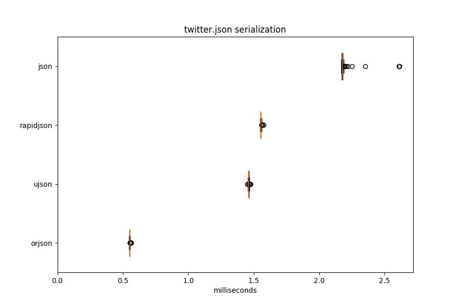
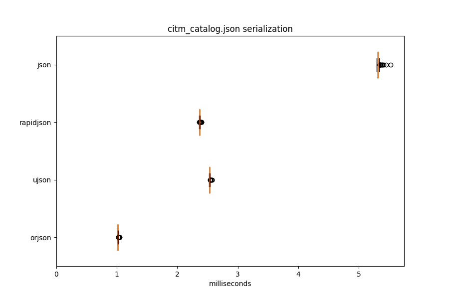
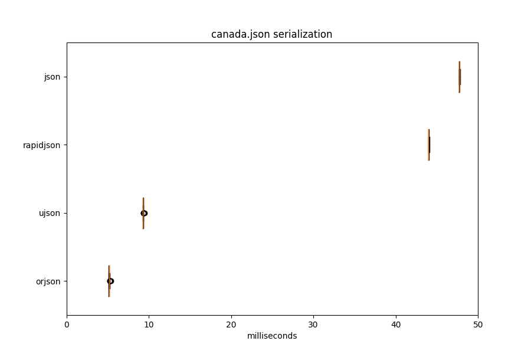

# orjson

orjson is a fast JSON library for Python. It benchmarks as the fastest Python
library for JSON serialization, about twice as fast or more as the nearest
other library, with deserialization performance slightly worse to similar to
the fastest library.

It supports Python 3.6 and Python 3.7 (CPython only). It is not intended
as a drop-in replacement for the standard library's json module.

## Usage

### Install

To install a manylinux wheel from PyPI:

```sh
pip install --upgrade orjson
```

To build a release wheel from source, assuming a Rust nightly toolchain
and Python environment:

```sh
git checkout https://github.com/ijl/orjson.git && cd orjson
git submodule init && git submodule update
pip install --upgrade pyo3-pack
pyo3-pack build --release --strip --interpreter python3.7
```

There is no runtime dependency other than a manylinux environment (i.e.,
deploying this does not require Rust or non-libc type libraries.)

### Serialize

```python
def dumps(obj: Union[unicode, bytes, dict, list, tuple, int, float]) -> bytes
```

`dumps()` serializes Python objects to JSON.

It has no options and does not support hooks for custom objects.

It raises `TypeError` on an unsupported type or a number that is too large.
The error message describes the invalid object.

```python
import orjson

try:
    val = orjson.dumps(...)
except TypeError:
    raise
```

### Deserialize

```python
def loads(obj: Union[bytes, unicode]) -> Any
```

`loads()` deserializes JSON to Python objects.

It raises `orjson.JSONDecodeError` on invalid input.


```python
import orjson

try:
    val = orjson.loads(...)
except orjson.JSONDecodeError:
    raise
```

### Comparison

There are slight differences in output between libraries. The differences
are not an issue for interoperability. Note orjson returns bytes. Its output
is slightly smaller as well.

```python
>>> import orjson, ujson, rapidjson, json
>>> data = {'bool': True, '🐈':'哈哈', 'int': 9223372036854775807, 'float': 1.337e+40}
>>> orjson.dumps(data)
b'{"bool":true,"\xf0\x9f\x90\x88":"\xe5\x93\x88\xe5\x93\x88","int":9223372036854775807,"float":1.337e40}'
>>> ujson.dumps(data)
'{"bool":true,"\\ud83d\\udc08":"\\u54c8\\u54c8","int":9223372036854775807,"float":1.337000000000000e+40}'
>>> rapidjson.dumps(data)
'{"bool":true,"\\uD83D\\uDC08":"\\u54C8\\u54C8","int":9223372036854775807,"float":1.337e+40}'
>>> json.dumps(data)
'{"bool": true, "\\ud83d\\udc08": "\\u54c8\\u54c8", "int": 9223372036854775807, "float": 1.337e+40}'
```

## Testing

The library has comprehensive tests. There are unit tests against the
roundtrip, jsonchecker, and fixtures files of the
[nativejson-benchmark](https://github.com/miloyip/nativejson-benchmark)
repository. It is tested to not crash against the
[Big List of Naughty Strings](https://github.com/minimaxir/big-list-of-naughty-strings).
There are integration tests exercising the library's use in web
servers (uwsgi and gunicorn, using multiprocess/forked workers) and when
multithreaded. It also uses some tests from the ultrajson library.

## Performance

Serialization performance of orjson is better than ultrajson, rapidjson, or
json. Deserialization performance is worse to about the same as ultrajson.





#### canada.json deserialization

| Library   |   Median (milliseconds) |   Operations per second |   Relative (latency) |
|-----------|-------------------------|-------------------------|----------------------|
| orjson    |                   17.58 |                    64.3 |                 1.04 |
| ujson     |                   16.85 |                    66.3 |                 1    |
| rapidjson |                   37.26 |                    28.4 |                 2.21 |
| json      |                   37.53 |                    27.8 |                 2.23 |

#### canada.json serialization

| Library   |   Median (milliseconds) |   Operations per second |   Relative (latency) |
|-----------|-------------------------|-------------------------|----------------------|
| orjson    |                    5.08 |                   195.6 |                 1    |
| ujson     |                    9.39 |                   106.3 |                 1.85 |
| rapidjson |                   43.96 |                    22.7 |                 8.65 |
| json      |                   47.57 |                    21   |                 9.36 |

#### citm_catalog.json deserialization

| Library   |   Median (milliseconds) |   Operations per second |   Relative (latency) |
|-----------|-------------------------|-------------------------|----------------------|
| orjson    |                    6.75 |                   120.6 |                 1.02 |
| ujson     |                    6.63 |                   121.5 |                 1    |
| rapidjson |                    7.99 |                   106.1 |                 1.2  |
| json      |                    7.99 |                   103.7 |                 1.2  |

#### citm_catalog.json serialization

| Library   |   Median (milliseconds) |   Operations per second |   Relative (latency) |
|-----------|-------------------------|-------------------------|----------------------|
| orjson    |                    1.12 |                   891   |                 1    |
| ujson     |                    3.97 |                   251.5 |                 3.55 |
| rapidjson |                    2.37 |                   420.9 |                 2.12 |
| json      |                    5.34 |                   187.1 |                 4.78 |

#### twitter.json deserialization

| Library   |   Median (milliseconds) |   Operations per second |   Relative (latency) |
|-----------|-------------------------|-------------------------|----------------------|
| orjson    |                    3.38 |                   278.9 |                 1.17 |
| ujson     |                    2.88 |                   332.8 |                 1    |
| rapidjson |                    3.35 |                   252.7 |                 1.16 |
| json      |                    3.3  |                   289.2 |                 1.15 |

#### twitter.json serialization

| Library   |   Median (milliseconds) |   Operations per second |   Relative (latency) |
|-----------|-------------------------|-------------------------|----------------------|
| orjson    |                    0.59 |                  1699.5 |                 1    |
| ujson     |                    1.89 |                   529.8 |                 3.22 |
| rapidjson |                    1.57 |                   637.3 |                 2.68 |
| json      |                    2.17 |                   458.5 |                 3.71 |

This was measured using orjson 1.0.0 on Python 3.7.1. The above can be
reproduced using the `pybench` and `graph` scripts.

## License

orjson is dual licensed under the Apache 2.0 and MIT licenses. It contains
code from the hyperjson and ultrajson libraries. It is implemented using
the [serde_json](https://github.com/serde-rs/json) and
[pyo3](https://github.com/PyO3/pyo3) libraries.
