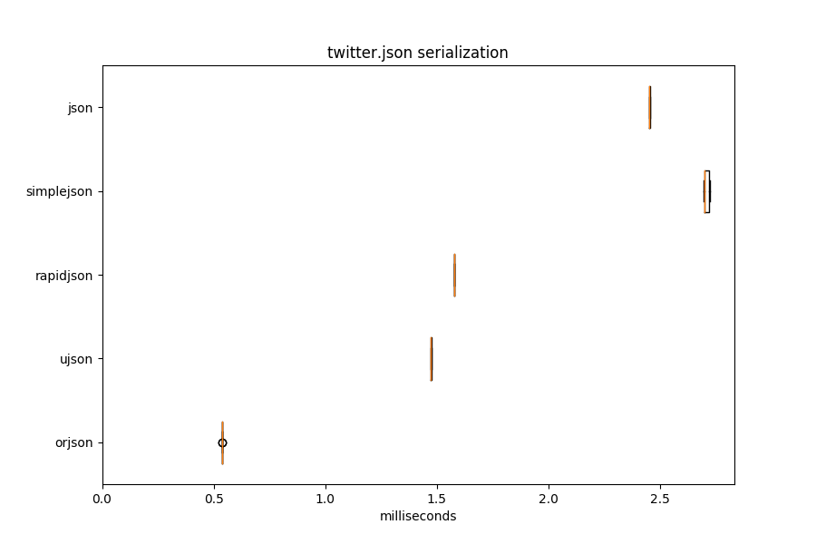
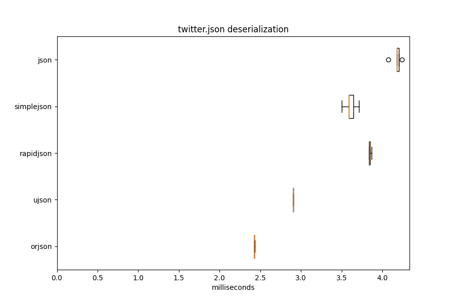
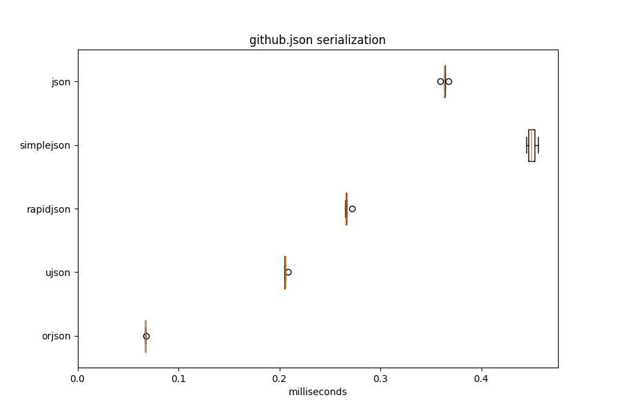
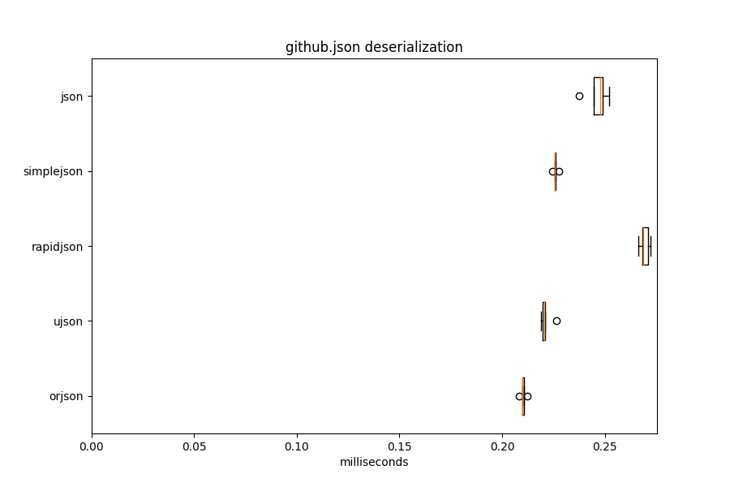
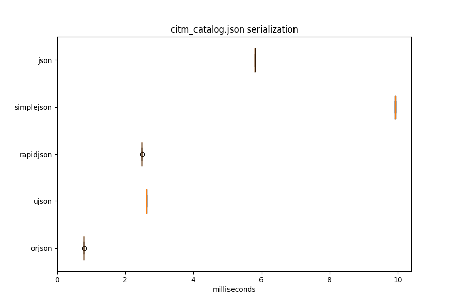
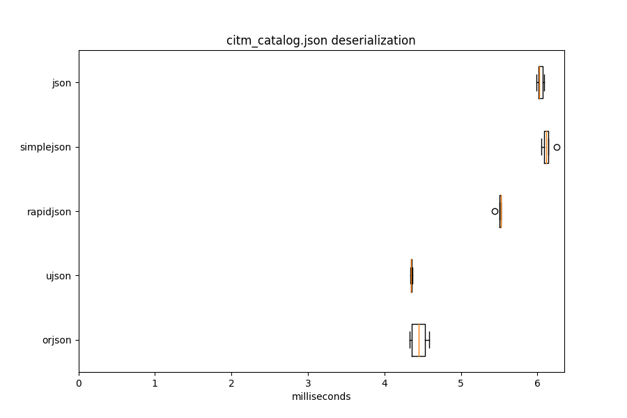

# orjson

orjson is a fast, correct JSON library for Python. It
[benchmarks](https://github.com/ijl/orjson#performance) as the fastest Python
library for JSON and is more correct than the standard json library or other
third-party libraries. It serializes
[dataclass](https://github.com/ijl/orjson#dataclass),
[datetime](https://github.com/ijl/orjson#datetime),
[numpy](https://github.com/ijl/orjson#numpy), and
[UUID](https://github.com/ijl/orjson#uuid) instances natively.

Its features and drawbacks compared to other Python JSON libraries:

* serializes `dataclass` instances 40-50x as fast as other libraries
* serializes `datetime`, `date`, and `time` instances to RFC 3339 format,
e.g., "1970-01-01T00:00:00+00:00"
* serializes `numpy.ndarray` instances 4-12x as fast with 0.3x the memory
usage of other libraries
* pretty prints 10x to 20x as fast as the standard library
* serializes to `bytes` rather than `str`, i.e., is not a drop-in replacement
* serializes `str` without escaping unicode to ASCII, e.g., "好" rather than
"\\\u597d"
* serializes `float` 10x as fast and deserializes twice as fast as other
libraries
* serializes subclasses of `str`, `int`, `list`, and `dict` natively,
requiring `default` to specify how to serialize others
* serializes arbitrary types using a `default` hook
* has strict UTF-8 conformance, more correct than the standard library
* has strict JSON conformance in not supporting Nan/Infinity/-Infinity
* has an option for strict JSON conformance on 53-bit integers with default
support for 64-bit
* does not provide `load()` or `dump()` functions for reading from/writing to
file-like objects

orjson supports CPython 3.7, 3.8, 3.9, and 3.10. It distributes x86_64/amd64
and aarch64/armv8 wheels for Linux and macOS. It distributes x86_64/amd64 wheels
for Windows. orjson does not support PyPy. Releases follow semantic
versioning and serializing a new object type without an opt-in flag is
considered a breaking change.

orjson is licensed under both the Apache 2.0 and MIT licenses. The
repository and issue tracker is
[github.com/ijl/orjson](https://github.com/ijl/orjson), and patches may be
submitted there. There is a
[CHANGELOG](https://github.com/ijl/orjson/blob/master/CHANGELOG.md)
available in the repository.

1. [Usage](https://github.com/ijl/orjson#usage)
    1. [Install](https://github.com/ijl/orjson#install)
    2. [Quickstart](https://github.com/ijl/orjson#quickstart)
    3. [Migrating](https://github.com/ijl/orjson#migrating)
    4. [Serialize](https://github.com/ijl/orjson#serialize)
        1. [default](https://github.com/ijl/orjson#default)
        2. [option](https://github.com/ijl/orjson#option)
    5. [Deserialize](https://github.com/ijl/orjson#deserialize)
2. [Types](https://github.com/ijl/orjson#types)
    1. [dataclass](https://github.com/ijl/orjson#dataclass)
    2. [datetime](https://github.com/ijl/orjson#datetime)
    3. [enum](https://github.com/ijl/orjson#enum)
    4. [float](https://github.com/ijl/orjson#float)
    5. [int](https://github.com/ijl/orjson#int)
    6. [numpy](https://github.com/ijl/orjson#numpy)
    7. [str](https://github.com/ijl/orjson#str)
    8. [uuid](https://github.com/ijl/orjson#uuid)
3. [Testing](https://github.com/ijl/orjson#testing)
4. [Performance](https://github.com/ijl/orjson#performance)
    1. [Latency](https://github.com/ijl/orjson#latency)
    2. [Memory](https://github.com/ijl/orjson#memory)
    3. [Reproducing](https://github.com/ijl/orjson#reproducing)
5. [Questions](https://github.com/ijl/orjson#questions)
6. [Packaging](https://github.com/ijl/orjson#packaging)
7. [License](https://github.com/ijl/orjson#license)

## Usage

### Install

To install a wheel from PyPI:

```sh
pip install --upgrade "pip>=20.3" # manylinux_x_y, universal2 wheel support
pip install --upgrade orjson
```

To build a wheel, see [packaging](https://github.com/ijl/orjson#packaging).

### Quickstart

This is an example of serializing, with options specified, and deserializing:

```python
>>> import orjson, datetime, numpy
>>> data = {
    "type": "job",
    "created_at": datetime.datetime(1970, 1, 1),
    "status": "🆗",
    "payload": numpy.array([[1, 2], [3, 4]]),
}
>>> orjson.dumps(data, option=orjson.OPT_NAIVE_UTC | orjson.OPT_SERIALIZE_NUMPY)
b'{"type":"job","created_at":"1970-01-01T00:00:00+00:00","status":"\xf0\x9f\x86\x97","payload":[[1,2],[3,4]]}'
>>> orjson.loads(_)
{'type': 'job', 'created_at': '1970-01-01T00:00:00+00:00', 'status': '🆗', 'payload': [[1, 2], [3, 4]]}
```

### Migrating

orjson version 3 serializes more types than version 2. Subclasses of `str`,
`int`, `dict`, and `list` are now serialized. This is faster and more similar
to the standard library. It can be disabled with
`orjson.OPT_PASSTHROUGH_SUBCLASS`.`dataclasses.dataclass` instances
are now serialized by default and cannot be customized in a
`default` function unless `option=orjson.OPT_PASSTHROUGH_DATACLASS` is
specified. `uuid.UUID` instances are serialized by default.
For any type that is now serialized,
implementations in a `default` function and options enabling them can be
removed but do not need to be. There was no change in deserialization.

To migrate from the standard library, the largest difference is that
`orjson.dumps` returns `bytes` and `json.dumps` returns a `str`. Users with
`dict` objects using non-`str` keys should specify
`option=orjson.OPT_NON_STR_KEYS`. `sort_keys` is replaced by
`option=orjson.OPT_SORT_KEYS`. `indent` is replaced by
`option=orjson.OPT_INDENT_2` and other levels of indentation are not
supported.

### Serialize

```python
def dumps(
    __obj: Any,
    default: Optional[Callable[[Any], Any]] = ...,
    option: Optional[int] = ...,
) -> bytes: ...
```

`dumps()` serializes Python objects to JSON.

It natively serializes
`str`, `dict`, `list`, `tuple`, `int`, `float`, `bool`,
`dataclasses.dataclass`, `typing.TypedDict`, `datetime.datetime`,
`datetime.date`, `datetime.time`, `uuid.UUID`, `numpy.ndarray`, and
`None` instances. It supports arbitrary types through `default`. It
serializes subclasses of `str`, `int`, `dict`, `list`,
`dataclasses.dataclass`, and `enum.Enum`. It does not serialize subclasses
of `tuple` to avoid serializing `namedtuple` objects as arrays. To avoid
serializing subclasses, specify the option `orjson.OPT_PASSTHROUGH_SUBCLASS`.

The output is a `bytes` object containing UTF-8.

The global interpreter lock (GIL) is held for the duration of the call.

It raises `JSONEncodeError` on an unsupported type. This exception message
describes the invalid object with the error message
`Type is not JSON serializable: ...`. To fix this, specify
[default](https://github.com/ijl/orjson#default).

It raises `JSONEncodeError` on a `str` that contains invalid UTF-8.

It raises `JSONEncodeError` on an integer that exceeds 64 bits by default or,
with `OPT_STRICT_INTEGER`, 53 bits.

It raises `JSONEncodeError` if a `dict` has a key of a type other than `str`,
unless `OPT_NON_STR_KEYS` is specified.

It raises `JSONEncodeError` if the output of `default` recurses to handling by
`default` more than 254 levels deep.

It raises `JSONEncodeError` on circular references.

It raises `JSONEncodeError`  if a `tzinfo` on a datetime object is
unsupported.

`JSONEncodeError` is a subclass of `TypeError`. This is for compatibility
with the standard library.

#### default

To serialize a subclass or arbitrary types, specify `default` as a
callable that returns a supported type. `default` may be a function,
lambda, or callable class instance. To specify that a type was not
handled by `default`, raise an exception such as `TypeError`.

```python
>>> import orjson, decimal
>>>
def default(obj):
    if isinstance(obj, decimal.Decimal):
        return str(obj)
    raise TypeError

>>> orjson.dumps(decimal.Decimal("0.0842389659712649442845"))
JSONEncodeError: Type is not JSON serializable: decimal.Decimal
>>> orjson.dumps(decimal.Decimal("0.0842389659712649442845"), default=default)
b'"0.0842389659712649442845"'
>>> orjson.dumps({1, 2}, default=default)
orjson.JSONEncodeError: Type is not JSON serializable: set
```

The `default` callable may return an object that itself
must be handled by `default` up to 254 times before an exception
is raised.

It is important that `default` raise an exception if a type cannot be handled.
Python otherwise implicitly returns `None`, which appears to the caller
like a legitimate value and is serialized:

```python
>>> import orjson, json, rapidjson
>>>
def default(obj):
    if isinstance(obj, decimal.Decimal):
        return str(obj)

>>> orjson.dumps({"set":{1, 2}}, default=default)
b'{"set":null}'
>>> json.dumps({"set":{1, 2}}, default=default)
'{"set":null}'
>>> rapidjson.dumps({"set":{1, 2}}, default=default)
'{"set":null}'
```

#### option

To modify how data is serialized, specify `option`. Each `option` is an integer
constant in `orjson`. To specify multiple options, mask them together, e.g.,
`option=orjson.OPT_STRICT_INTEGER | orjson.OPT_NAIVE_UTC`.

##### OPT_APPEND_NEWLINE

Append `\n` to the output. This is a convenience and optimization for the
pattern of `dumps(...) + "\n"`. `bytes` objects are immutable and this
pattern copies the original contents.

```python
>>> import orjson
>>> orjson.dumps([])
b"[]"
>>> orjson.dumps([], option=orjson.OPT_APPEND_NEWLINE)
b"[]\n"
```

##### OPT_INDENT_2

Pretty-print output with an indent of two spaces. This is equivalent to
`indent=2` in the standard library. Pretty printing is slower and the output
larger. orjson is the fastest compared library at pretty printing and has
much less of a slowdown to pretty print than the standard library does. This
option is compatible with all other options.

```python
>>> import orjson
>>> orjson.dumps({"a": "b", "c": {"d": True}, "e": [1, 2]})
b'{"a":"b","c":{"d":true},"e":[1,2]}'
>>> orjson.dumps(
    {"a": "b", "c": {"d": True}, "e": [1, 2]},
    option=orjson.OPT_INDENT_2
)
b'{\n  "a": "b",\n  "c": {\n    "d": true\n  },\n  "e": [\n    1,\n    2\n  ]\n}'
```

If displayed, the indentation and linebreaks appear like this:

```json
{
  "a": "b",
  "c": {
    "d": true
  },
  "e": [
    1,
    2
  ]
}
```

This measures serializing the github.json fixture as compact (52KiB) or
pretty (64KiB):

| Library    |   compact (ms) | pretty (ms)   | vs. orjson   |
|------------|----------------|---------------|--------------|
| orjson     |           0.06 | 0.07          | 1.0          |
| ujson      |           0.18 | 0.19          | 2.8          |
| rapidjson  |           0.22 |               |              |
| simplejson |           0.35 | 1.49          | 21.4         |
| json       |           0.36 | 1.19          | 17.2         |

This measures serializing the citm_catalog.json fixture, more of a worst
case due to the amount of nesting and newlines, as compact (489KiB) or
pretty (1.1MiB):

| Library    |   compact (ms) | pretty (ms)   | vs. orjson   |
|------------|----------------|---------------|--------------|
| orjson     |           0.88 | 1.73          | 1.0          |
| ujson      |           3.73 | 4.52          | 2.6          |
| rapidjson  |           3.54 |               |              |
| simplejson |          11.77 | 72.06         | 41.6         |
| json       |           6.71 | 55.22         | 31.9         |

rapidjson is blank because it does not support pretty printing. This can be
reproduced using the `pyindent` script.

##### OPT_NAIVE_UTC

Serialize `datetime.datetime` objects without a `tzinfo` as UTC. This
has no effect on `datetime.datetime` objects that have `tzinfo` set.

```python
>>> import orjson, datetime
>>> orjson.dumps(
        datetime.datetime(1970, 1, 1, 0, 0, 0),
    )
b'"1970-01-01T00:00:00"'
>>> orjson.dumps(
        datetime.datetime(1970, 1, 1, 0, 0, 0),
        option=orjson.OPT_NAIVE_UTC,
    )
b'"1970-01-01T00:00:00+00:00"'
```

##### OPT_NON_STR_KEYS

Serialize `dict` keys of type other than `str`. This allows `dict` keys
to be one of `str`, `int`, `float`, `bool`, `None`, `datetime.datetime`,
`datetime.date`, `datetime.time`, `enum.Enum`, and `uuid.UUID`. For comparison,
the standard library serializes `str`, `int`, `float`, `bool` or `None` by
default. orjson benchmarks as being faster at serializing non-`str` keys
than other libraries. This option is slower for `str` keys than the default.

```python
>>> import orjson, datetime, uuid
>>> orjson.dumps(
        {uuid.UUID("7202d115-7ff3-4c81-a7c1-2a1f067b1ece"): [1, 2, 3]},
        option=orjson.OPT_NON_STR_KEYS,
    )
b'{"7202d115-7ff3-4c81-a7c1-2a1f067b1ece":[1,2,3]}'
>>> orjson.dumps(
        {datetime.datetime(1970, 1, 1, 0, 0, 0): [1, 2, 3]},
        option=orjson.OPT_NON_STR_KEYS | orjson.OPT_NAIVE_UTC,
    )
b'{"1970-01-01T00:00:00+00:00":[1,2,3]}'
```

These types are generally serialized how they would be as
values, e.g., `datetime.datetime` is still an RFC 3339 string and respects
options affecting it. The exception is that `int` serialization does not
respect `OPT_STRICT_INTEGER`.

This option has the risk of creating duplicate keys. This is because non-`str`
objects may serialize to the same `str` as an existing key, e.g.,
`{"1": true, 1: false}`. The last key to be inserted to the `dict` will be
serialized last and a JSON deserializer will presumably take the last
occurrence of a key (in the above, `false`). The first value will be lost.

This option is compatible with `orjson.OPT_SORT_KEYS`. If sorting is used,
note the sort is unstable and will be unpredictable for duplicate keys.

```python
>>> import orjson, datetime
>>> orjson.dumps(
    {"other": 1, datetime.date(1970, 1, 5): 2, datetime.date(1970, 1, 3): 3},
    option=orjson.OPT_NON_STR_KEYS | orjson.OPT_SORT_KEYS
)
b'{"1970-01-03":3,"1970-01-05":2,"other":1}'
```

This measures serializing 589KiB of JSON comprising a `list` of 100 `dict`
in which each `dict` has both 365 randomly-sorted `int` keys representing epoch
timestamps as well as one `str` key and the value for each key is a
single integer. In "str keys", the keys were converted to `str` before
serialization, and orjson still specifes `option=orjson.OPT_NON_STR_KEYS`
(which is always somewhat slower).

| Library    |   str keys (ms) | int keys (ms)   | int keys sorted (ms)   |
|------------|-----------------|-----------------|------------------------|
| orjson     |            1.53 | 2.16            | 4.29                   |
| ujson      |            3.07 | 5.65            |                        |
| rapidjson  |            4.29 |                 |                        |
| simplejson |           11.24 | 14.50           | 21.86                  |
| json       |            7.17 | 8.49            |                        |

ujson is blank for sorting because it segfaults. json is blank because it
raises `TypeError` on attempting to sort before converting all keys to `str`.
rapidjson is blank because it does not support non-`str` keys. This can
be reproduced using the `pynonstr` script.

##### OPT_OMIT_MICROSECONDS

Do not serialize the `microsecond` field on `datetime.datetime` and
`datetime.time` instances.

```python
>>> import orjson, datetime
>>> orjson.dumps(
        datetime.datetime(1970, 1, 1, 0, 0, 0, 1),
    )
b'"1970-01-01T00:00:00.000001"'
>>> orjson.dumps(
        datetime.datetime(1970, 1, 1, 0, 0, 0, 1),
        option=orjson.OPT_OMIT_MICROSECONDS,
    )
b'"1970-01-01T00:00:00"'
```

##### OPT_PASSTHROUGH_DATACLASS

Passthrough `dataclasses.dataclass` instances to `default`. This allows
customizing their output but is much slower.


```python
>>> import orjson, dataclasses
>>>
@dataclasses.dataclass
class User:
    id: str
    name: str
    password: str

def default(obj):
    if isinstance(obj, User):
        return {"id": obj.id, "name": obj.name}
    raise TypeError

>>> orjson.dumps(User("3b1", "asd", "zxc"))
b'{"id":"3b1","name":"asd","password":"zxc"}'
>>> orjson.dumps(User("3b1", "asd", "zxc"), option=orjson.OPT_PASSTHROUGH_DATACLASS)
TypeError: Type is not JSON serializable: User
>>> orjson.dumps(
        User("3b1", "asd", "zxc"),
        option=orjson.OPT_PASSTHROUGH_DATACLASS,
        default=default,
    )
b'{"id":"3b1","name":"asd"}'
```

##### OPT_PASSTHROUGH_DATETIME

Passthrough `datetime.datetime`, `datetime.date`, and `datetime.time` instances
to `default`. This allows serializing datetimes to a custom format, e.g.,
HTTP dates:

```python
>>> import orjson, datetime
>>>
def default(obj):
    if isinstance(obj, datetime.datetime):
        return obj.strftime("%a, %d %b %Y %H:%M:%S GMT")
    raise TypeError

>>> orjson.dumps({"created_at": datetime.datetime(1970, 1, 1)})
b'{"created_at":"1970-01-01T00:00:00"}'
>>> orjson.dumps({"created_at": datetime.datetime(1970, 1, 1)}, option=orjson.OPT_PASSTHROUGH_DATETIME)
TypeError: Type is not JSON serializable: datetime.datetime
>>> orjson.dumps(
        {"created_at": datetime.datetime(1970, 1, 1)},
        option=orjson.OPT_PASSTHROUGH_DATETIME,
        default=default,
    )
b'{"created_at":"Thu, 01 Jan 1970 00:00:00 GMT"}'
```

This does not affect datetimes in `dict` keys if using OPT_NON_STR_KEYS.

##### OPT_PASSTHROUGH_SUBCLASS

Passthrough subclasses of builtin types to `default`.

```python
>>> import orjson
>>>
class Secret(str):
    pass

def default(obj):
    if isinstance(obj, Secret):
        return "******"
    raise TypeError

>>> orjson.dumps(Secret("zxc"))
b'"zxc"'
>>> orjson.dumps(Secret("zxc"), option=orjson.OPT_PASSTHROUGH_SUBCLASS)
TypeError: Type is not JSON serializable: Secret
>>> orjson.dumps(Secret("zxc"), option=orjson.OPT_PASSTHROUGH_SUBCLASS, default=default)
b'"******"'
```

This does not affect serializing subclasses as `dict` keys if using
OPT_NON_STR_KEYS.

##### OPT_SERIALIZE_DATACLASS

This is deprecated and has no effect in version 3. In version 2 this was
required to serialize  `dataclasses.dataclass` instances. For more, see
[dataclass](https://github.com/ijl/orjson#dataclass).

##### OPT_SERIALIZE_NUMPY

Serialize `numpy.ndarray` instances. For more, see
[numpy](https://github.com/ijl/orjson#numpy).

##### OPT_SERIALIZE_UUID

This is deprecated and has no effect in version 3. In version 2 this was
required to serialize `uuid.UUID` instances. For more, see
[UUID](https://github.com/ijl/orjson#UUID).

##### OPT_SORT_KEYS

Serialize `dict` keys in sorted order. The default is to serialize in an
unspecified order. This is equivalent to `sort_keys=True` in the standard
library.

This can be used to ensure the order is deterministic for hashing or tests.
It has a substantial performance penalty and is not recommended in general.

```python
>>> import orjson
>>> orjson.dumps({"b": 1, "c": 2, "a": 3})
b'{"b":1,"c":2,"a":3}'
>>> orjson.dumps({"b": 1, "c": 2, "a": 3}, option=orjson.OPT_SORT_KEYS)
b'{"a":3,"b":1,"c":2}'
```

This measures serializing the twitter.json fixture unsorted and sorted:

| Library    |   unsorted (ms) |   sorted (ms) |   vs. orjson |
|------------|-----------------|---------------|--------------|
| orjson     |            0.5  |          0.92 |          1   |
| ujson      |            1.61 |          2.48 |          2.7 |
| rapidjson  |            2.17 |          2.89 |          3.2 |
| simplejson |            3.56 |          5.13 |          5.6 |
| json       |            3.59 |          4.59 |          5   |

The benchmark can be reproduced using the `pysort` script.

The sorting is not collation/locale-aware:

```python
>>> import orjson
>>> orjson.dumps({"a": 1, "ä": 2, "A": 3}, option=orjson.OPT_SORT_KEYS)
b'{"A":3,"a":1,"\xc3\xa4":2}'
```

This is the same sorting behavior as the standard library, rapidjson,
simplejson, and ujson.

`dataclass` also serialize as maps but this has no effect on them.

##### OPT_STRICT_INTEGER

Enforce 53-bit limit on integers. The limit is otherwise 64 bits, the same as
the Python standard library. For more, see [int](https://github.com/ijl/orjson#int).

##### OPT_UTC_Z

Serialize a UTC timezone on `datetime.datetime` instances as `Z` instead
of `+00:00`.

```python
>>> import orjson, datetime
>>> orjson.dumps(
        datetime.datetime(1970, 1, 1, 0, 0, 0, tzinfo=datetime.timezone.utc),
    )
b'"1970-01-01T00:00:00+00:00"'
>>> orjson.dumps(
        datetime.datetime(1970, 1, 1, 0, 0, 0, tzinfo=datetime.timezone.utc),
        option=orjson.OPT_UTC_Z
    )
b'"1970-01-01T00:00:00Z"'
```

##### OPT_ENUM_NAME

Serialize enums using their name instead of value.

```python
>>> import orjson, enum
>>> class A(enum.Enum):
        FOO = 1
>>> orjson.dumps(A.FOO, option=orjson.OPT_ENUM_NAME)
b'"FOO"'
```

### Deserialize

```python
def loads(__obj: Union[bytes, bytearray, memoryview, str]) -> Any: ...
```

`loads()` deserializes JSON to Python objects. It deserializes to `dict`,
`list`, `int`, `float`, `str`, `bool`, and `None` objects.

`bytes`, `bytearray`, `memoryview`, and `str` input are accepted. If the input
exists as a `memoryview`, `bytearray`, or `bytes` object, it is recommended to
pass these directly rather than creating an unnecessary `str` object. This has
lower memory usage and lower latency.

The input must be valid UTF-8.

orjson maintains a cache of map keys for the duration of the process. This
causes a net reduction in memory usage by avoiding duplicate strings. The
keys must be at most 64 bytes to be cached and 512 entries are stored.

The global interpreter lock (GIL) is held for the duration of the call.

It raises `JSONDecodeError` if given an invalid type or invalid
JSON. This includes if the input contains `NaN`, `Infinity`, or `-Infinity`,
which the standard library allows, but is not valid JSON.

`JSONDecodeError` is a subclass of `json.JSONDecodeError` and `ValueError`.
This is for compatibility with the standard library.

## Types

### dataclass

orjson serializes instances of `dataclasses.dataclass` natively. It serializes
instances 40-50x as fast as other libraries and avoids a severe slowdown seen
in other libraries compared to serializing `dict`.

It is supported to pass all variants of dataclasses, including dataclasses
using `__slots__`, frozen dataclasses, those with optional or default
attributes, and subclasses. There is a performance benefit to not
using `__slots__`.

| Library    | dict (ms)   | dataclass (ms)   | vs. orjson   |
|------------|-------------|------------------|--------------|
| orjson     | 1.40        | 1.60             | 1            |
| ujson      |             |                  |              |
| rapidjson  | 3.64        | 68.48            | 42           |
| simplejson | 14.21       | 92.18            | 57           |
| json       | 13.28       | 94.90            | 59           |

This measures serializing 555KiB of JSON, orjson natively and other libraries
using `default` to serialize the output of `dataclasses.asdict()`. This can be
reproduced using the `pydataclass` script.

Dataclasses are serialized as maps, with every attribute serialized and in
the order given on class definition:

```python
>>> import dataclasses, orjson, typing

@dataclasses.dataclass
class Member:
    id: int
    active: bool = dataclasses.field(default=False)

@dataclasses.dataclass
class Object:
    id: int
    name: str
    members: typing.List[Member]

>>> orjson.dumps(Object(1, "a", [Member(1, True), Member(2)]))
b'{"id":1,"name":"a","members":[{"id":1,"active":true},{"id":2,"active":false}]}'
```
Users may wish to control how dataclass instances are serialized, e.g.,
to not serialize an attribute or to change the name of an
attribute when serialized. orjson may implement support using the
metadata mapping on `field` attributes,
e.g., `field(metadata={"json_serialize": False})`, if use cases are clear.

### datetime

orjson serializes `datetime.datetime` objects to
[RFC 3339](https://tools.ietf.org/html/rfc3339) format,
e.g., "1970-01-01T00:00:00+00:00". This is a subset of ISO 8601 and
compatible with `isoformat()` in the standard library.

```python
>>> import orjson, datetime, zoneinfo
>>> orjson.dumps(
    datetime.datetime(2018, 12, 1, 2, 3, 4, 9, tzinfo=zoneinfo.ZoneInfo('Australia/Adelaide'))
)
b'"2018-12-01T02:03:04.000009+10:30"'
>>> orjson.dumps(
    datetime.datetime.fromtimestamp(4123518902).replace(tzinfo=datetime.timezone.utc)
)
b'"2100-09-01T21:55:02+00:00"'
>>> orjson.dumps(
    datetime.datetime.fromtimestamp(4123518902)
)
b'"2100-09-01T21:55:02"'
```

`datetime.datetime` supports instances with a `tzinfo` that is `None`,
`datetime.timezone.utc`, a timezone instance from the python3.9+ `zoneinfo`
module, or a timezone instance from the third-party `pendulum`, `pytz`, or
`dateutil`/`arrow` libraries.

`datetime.time` objects must not have a `tzinfo`.

```python
>>> import orjson, datetime
>>> orjson.dumps(datetime.time(12, 0, 15, 290))
b'"12:00:15.000290"'
```

`datetime.date` objects will always serialize.

```python
>>> import orjson, datetime
>>> orjson.dumps(datetime.date(1900, 1, 2))
b'"1900-01-02"'
```

Errors with `tzinfo` result in `JSONEncodeError` being raised.

It is faster to have orjson serialize datetime objects than to do so
before calling `dumps()`. If using an unsupported type such as
`pendulum.datetime`, use `default`.

To disable serialization of `datetime` objects specify the option
`orjson.OPT_PASSTHROUGH_DATETIME`.

To use "Z" suffix instead of "+00:00" to indicate UTC ("Zulu") time, use the option
`orjson.OPT_UTC_Z`.

To assume datetimes without timezone are UTC, se the option `orjson.OPT_NAIVE_UTC`.

### enum

orjson serializes enums natively. By default orjson uses the enum value but with the `OPT_ENUM_NAME` option it can also use the name.

```python
>>> import enum, datetime, orjson
>>>
class DatetimeEnum(enum.Enum):
    EPOCH = datetime.datetime(1970, 1, 1, 0, 0, 0)
>>> orjson.dumps(DatetimeEnum.EPOCH)
b'"1970-01-01T00:00:00"'
>>> orjson.dumps(DatetimeEnum.EPOCH, option=orjson.OPT_NAIVE_UTC)
b'"1970-01-01T00:00:00+00:00"'
>>> orjson.dumps(DatetimeEnum.EPOCH, option=orjson.OPT_ENUM_NAME)
b'"EPOCH"'
```

Enums with members that are not supported types can be serialized using
`default`:

```python
>>> import enum, orjson
>>>
class Custom:
    def __init__(self, val):
        self.val = val

def default(obj):
    if isinstance(obj, Custom):
        return obj.val
    raise TypeError

class CustomEnum(enum.Enum):
    ONE = Custom(1)

>>> orjson.dumps(CustomEnum.ONE, default=default)
b'1'
```

### float

orjson serializes and deserializes double precision floats with no loss of
precision and consistent rounding. The same behavior is observed in rapidjson,
simplejson, and json. ujson 1.35 was inaccurate in both serialization and
deserialization, i.e., it modifies the data, and the recent 2.0 release is
accurate.

`orjson.dumps()` serializes Nan, Infinity, and -Infinity, which are not
compliant JSON, as `null`:

```python
>>> import orjson, ujson, rapidjson, json
>>> orjson.dumps([float("NaN"), float("Infinity"), float("-Infinity")])
b'[null,null,null]'
>>> ujson.dumps([float("NaN"), float("Infinity"), float("-Infinity")])
OverflowError: Invalid Inf value when encoding double
>>> rapidjson.dumps([float("NaN"), float("Infinity"), float("-Infinity")])
'[NaN,Infinity,-Infinity]'
>>> json.dumps([float("NaN"), float("Infinity"), float("-Infinity")])
'[NaN, Infinity, -Infinity]'
```

### int

orjson serializes and deserializes 64-bit integers by default. The range
supported is a signed 64-bit integer's minimum (-9223372036854775807) to
an unsigned 64-bit integer's maximum (18446744073709551615). This
is widely compatible, but there are implementations
that only support 53-bits for integers, e.g.,
web browsers. For those implementations, `dumps()` can be configured to
raise a `JSONEncodeError` on values exceeding the 53-bit range.

```python
>>> import orjson
>>> orjson.dumps(9007199254740992)
b'9007199254740992'
>>> orjson.dumps(9007199254740992, option=orjson.OPT_STRICT_INTEGER)
JSONEncodeError: Integer exceeds 53-bit range
>>> orjson.dumps(-9007199254740992, option=orjson.OPT_STRICT_INTEGER)
JSONEncodeError: Integer exceeds 53-bit range
```

### numpy

orjson natively serializes `numpy.ndarray` and individual `numpy.float64`,
`numpy.float32`, `numpy.int64`, `numpy.int32`, `numpy.int8`, `numpy.uint64`,
`numpy.uint32`, `numpy.uint8`, `numpy.uintp`, or `numpy.intp`, and
`numpy.datetime64` instances.

orjson is faster than all compared libraries at serializing
numpy instances. Serializing numpy data requires specifying
`option=orjson.OPT_SERIALIZE_NUMPY`.

```python
>>> import orjson, numpy
>>> orjson.dumps(
        numpy.array([[1, 2, 3], [4, 5, 6]]),
        option=orjson.OPT_SERIALIZE_NUMPY,
)
b'[[1,2,3],[4,5,6]]'
```

The array must be a contiguous C array (`C_CONTIGUOUS`) and one of the
supported datatypes.

`numpy.datetime64` instances are serialized as RFC 3339 strings and
datetime options affect them.

```python
>>> import orjson, numpy
>>> orjson.dumps(
        numpy.datetime64("2021-01-01T00:00:00.172"),
        option=orjson.OPT_SERIALIZE_NUMPY,
)
b'"2021-01-01T00:00:00.172000"'
>>> orjson.dumps(
        numpy.datetime64("2021-01-01T00:00:00.172"),
        option=(
            orjson.OPT_SERIALIZE_NUMPY |
            orjson.OPT_NAIVE_UTC |
            orjson.OPT_OMIT_MICROSECONDS
        ),
)
b'"2021-01-01T00:00:00+00:00"'
```

If an array is not a contiguous C array, contains an supported datatype,
or contains a `numpy.datetime64` using an unsupported representation
(e.g., picoseconds), orjson falls through to `default`. In `default`,
`obj.tolist()` can be specified. If an array is malformed, which
is not expected, `orjson.JSONEncodeError` is raised.

This measures serializing 92MiB of JSON from an `numpy.ndarray` with
dimensions of `(50000, 100)` and `numpy.float64` values:

| Library    | Latency (ms)   | RSS diff (MiB)   | vs. orjson   |
|------------|----------------|------------------|--------------|
| orjson     | 194            | 99               | 1.0          |
| ujson      |                |                  |              |
| rapidjson  | 3,048          | 309              | 15.7         |
| simplejson | 3,023          | 297              | 15.6         |
| json       | 3,133          | 297              | 16.1         |

This measures serializing 100MiB of JSON from an `numpy.ndarray` with
dimensions of `(100000, 100)` and `numpy.int32` values:

| Library    | Latency (ms)   | RSS diff (MiB)   | vs. orjson   |
|------------|----------------|------------------|--------------|
| orjson     | 178            | 115              | 1.0          |
| ujson      |                |                  |              |
| rapidjson  | 1,512          | 551              | 8.5          |
| simplejson | 1,606          | 504              | 9.0          |
| json       | 1,506          | 503              | 8.4          |

This measures serializing 105MiB of JSON from an `numpy.ndarray` with
dimensions of `(100000, 200)` and `numpy.bool` values:

| Library    | Latency (ms)   | RSS diff (MiB)   | vs. orjson   |
|------------|----------------|------------------|--------------|
| orjson     | 157            | 120              | 1.0          |
| ujson      |                |                  |              |
| rapidjson  | 710            | 327              | 4.5          |
| simplejson | 931            | 398              | 5.9          |
| json       | 996            | 400              | 6.3          |

In these benchmarks, orjson serializes natively, ujson is blank because it
does not support a `default` parameter, and the other libraries serialize
`ndarray.tolist()` via `default`. The RSS column measures peak memory
usage during serialization. This can be reproduced using the `pynumpy` script.

orjson does not have an installation or compilation dependency on numpy. The
implementation is independent, reading `numpy.ndarray` using
`PyArrayInterface`.

### str

orjson is strict about UTF-8 conformance. This is stricter than the standard
library's json module, which will serialize and deserialize UTF-16 surrogates,
e.g., "\ud800", that are invalid UTF-8.

If `orjson.dumps()` is given a `str` that does not contain valid UTF-8,
`orjson.JSONEncodeError` is raised. If `loads()` receives invalid UTF-8,
`orjson.JSONDecodeError` is raised.

orjson and rapidjson are the only compared JSON libraries to consistently
error on bad input.

```python
>>> import orjson, ujson, rapidjson, json
>>> orjson.dumps('\ud800')
JSONEncodeError: str is not valid UTF-8: surrogates not allowed
>>> ujson.dumps('\ud800')
UnicodeEncodeError: 'utf-8' codec ...
>>> rapidjson.dumps('\ud800')
UnicodeEncodeError: 'utf-8' codec ...
>>> json.dumps('\ud800')
'"\\ud800"'
>>> orjson.loads('"\\ud800"')
JSONDecodeError: unexpected end of hex escape at line 1 column 8: line 1 column 1 (char 0)
>>> ujson.loads('"\\ud800"')
''
>>> rapidjson.loads('"\\ud800"')
ValueError: Parse error at offset 1: The surrogate pair in string is invalid.
>>> json.loads('"\\ud800"')
'\ud800'
```

To make a best effort at deserializing bad input, first decode `bytes` using
the `replace` or `lossy` argument for `errors`:

```python
>>> import orjson
>>> orjson.loads(b'"\xed\xa0\x80"')
JSONDecodeError: str is not valid UTF-8: surrogates not allowed
>>> orjson.loads(b'"\xed\xa0\x80"'.decode("utf-8", "replace"))
'���'
```

### uuid

orjson serializes `uuid.UUID` instances to
[RFC 4122](https://tools.ietf.org/html/rfc4122) format, e.g.,
"f81d4fae-7dec-11d0-a765-00a0c91e6bf6".

``` python
>>> import orjson, uuid
>>> orjson.dumps(uuid.UUID('f81d4fae-7dec-11d0-a765-00a0c91e6bf6'))
b'"f81d4fae-7dec-11d0-a765-00a0c91e6bf6"'
>>> orjson.dumps(uuid.uuid5(uuid.NAMESPACE_DNS, "python.org"))
b'"886313e1-3b8a-5372-9b90-0c9aee199e5d"'
```

## Testing

The library has comprehensive tests. There are tests against fixtures in the
[JSONTestSuite](https://github.com/nst/JSONTestSuite) and
[nativejson-benchmark](https://github.com/miloyip/nativejson-benchmark)
repositories. It is tested to not crash against the
[Big List of Naughty Strings](https://github.com/minimaxir/big-list-of-naughty-strings).
It is tested to not leak memory. It is tested to not crash
against and not accept invalid UTF-8. There are integration tests
exercising the library's use in web servers (gunicorn using multiprocess/forked
workers) and when
multithreaded. It also uses some tests from the ultrajson library.

orjson is the most correct of the compared libraries. This graph shows how each
library handles a combined 342 JSON fixtures from the
[JSONTestSuite](https://github.com/nst/JSONTestSuite) and
[nativejson-benchmark](https://github.com/miloyip/nativejson-benchmark) tests:

| Library    |   Invalid JSON documents not rejected |   Valid JSON documents not deserialized |
|------------|---------------------------------------|-----------------------------------------|
| orjson     |                                     0 |                                       0 |
| ujson      |                                    38 |                                       0 |
| rapidjson  |                                     6 |                                       0 |
| simplejson |                                    13 |                                       0 |
| json       |                                    17 |                                       0 |

This shows that all libraries deserialize valid JSON but only orjson
correctly rejects the given invalid JSON fixtures. Errors are largely due to
accepting invalid strings and numbers.

The graph above can be reproduced using the `pycorrectness` script.

## Performance

Serialization and deserialization performance of orjson is better than
ultrajson, rapidjson, simplejson, or json. The benchmarks are done on
fixtures of real data:

* twitter.json, 631.5KiB, results of a search on Twitter for "一", containing
CJK strings, dictionaries of strings and arrays of dictionaries, indented.

* github.json, 55.8KiB, a GitHub activity feed, containing dictionaries of
strings and arrays of dictionaries, not indented.

* citm_catalog.json, 1.7MiB, concert data, containing nested dictionaries of
strings and arrays of integers, indented.

* canada.json, 2.2MiB, coordinates of the Canadian border in GeoJSON
format, containing floats and arrays, indented.

### Latency









#### twitter.json serialization

| Library    |   Median latency (milliseconds) |   Operations per second |   Relative (latency) |
|------------|---------------------------------|-------------------------|----------------------|
| orjson     |                            0.59 |                  1698.8 |                 1    |
| ujson      |                            2.14 |                   464.3 |                 3.64 |
| rapidjson  |                            2.39 |                   418.5 |                 4.06 |
| simplejson |                            3.15 |                   316.9 |                 5.36 |
| json       |                            3.56 |                   281.2 |                 6.06 |

#### twitter.json deserialization

| Library    |   Median latency (milliseconds) |   Operations per second |   Relative (latency) |
|------------|---------------------------------|-------------------------|----------------------|
| orjson     |                            2.28 |                   439.3 |                 1    |
| ujson      |                            2.89 |                   345.9 |                 1.27 |
| rapidjson  |                            3.85 |                   259.6 |                 1.69 |
| simplejson |                            3.66 |                   272.1 |                 1.61 |
| json       |                            4.05 |                   246.7 |                 1.78 |

#### github.json serialization

| Library    |   Median latency (milliseconds) |   Operations per second |   Relative (latency) |
|------------|---------------------------------|-------------------------|----------------------|
| orjson     |                            0.07 |                 15265.2 |                 1    |
| ujson      |                            0.22 |                  4556.7 |                 3.35 |
| rapidjson  |                            0.26 |                  3808.9 |                 4.02 |
| simplejson |                            0.37 |                  2690.4 |                 5.68 |
| json       |                            0.35 |                  2847.8 |                 5.36 |

#### github.json deserialization

| Library    |   Median latency (milliseconds) |   Operations per second |   Relative (latency) |
|------------|---------------------------------|-------------------------|----------------------|
| orjson     |                            0.18 |                  5610.1 |                 1    |
| ujson      |                            0.28 |                  3540.7 |                 1.58 |
| rapidjson  |                            0.33 |                  3031.5 |                 1.85 |
| simplejson |                            0.29 |                  3385.6 |                 1.65 |
| json       |                            0.29 |                  3402.1 |                 1.65 |

#### citm_catalog.json serialization

| Library    |   Median latency (milliseconds) |   Operations per second |   Relative (latency) |
|------------|---------------------------------|-------------------------|----------------------|
| orjson     |                            0.99 |                  1008.5 |                 1    |
| ujson      |                            3.69 |                   270.7 |                 3.72 |
| rapidjson  |                            3.55 |                   281.4 |                 3.58 |
| simplejson |                           11.76 |                    85.1 |                11.85 |
| json       |                            6.89 |                   145.1 |                 6.95 |

#### citm_catalog.json deserialization

| Library    |   Median latency (milliseconds) |   Operations per second |   Relative (latency) |
|------------|---------------------------------|-------------------------|----------------------|
| orjson     |                            4.53 |                   220.5 |                 1    |
| ujson      |                            5.67 |                   176.5 |                 1.25 |
| rapidjson  |                            7.51 |                   133.3 |                 1.66 |
| simplejson |                            7.54 |                   132.7 |                 1.66 |
| json       |                            7.8  |                   128.2 |                 1.72 |

#### canada.json serialization

| Library    |   Median latency (milliseconds) |   Operations per second |   Relative (latency) |
|------------|---------------------------------|-------------------------|----------------------|
| orjson     |                            4.72 |                   198.9 |                 1    |
| ujson      |                           17.76 |                    56.3 |                 3.77 |
| rapidjson  |                           61.83 |                    16.2 |                13.11 |
| simplejson |                           80.6  |                    12.4 |                17.09 |
| json       |                           52.38 |                    18.8 |                11.11 |

#### canada.json deserialization

| Library    |   Median latency (milliseconds) |   Operations per second |   Relative (latency) |
|------------|---------------------------------|-------------------------|----------------------|
| orjson     |                           10.28 |                    97.4 |                 1    |
| ujson      |                           16.49 |                    60.5 |                 1.6  |
| rapidjson  |                           37.92 |                    26.4 |                 3.69 |
| simplejson |                           37.7  |                    26.5 |                 3.67 |
| json       |                           37.87 |                    27.6 |                 3.68 |

### Memory

orjson's memory usage when deserializing is similar to or lower than
the standard library and other third-party libraries.

This measures, in the first column, RSS after importing a library and reading
the fixture, and in the second column, increases in RSS after repeatedly
calling `loads()` on the fixture.

#### twitter.json

| Library    |   import, read() RSS (MiB) |   loads() increase in RSS (MiB) |
|------------|----------------------------|---------------------------------|
| orjson     |                       13.5 |                             2.5 |
| ujson      |                       14   |                             4.1 |
| rapidjson  |                       14.7 |                             6.5 |
| simplejson |                       13.2 |                             2.5 |
| json       |                       12.9 |                             2.3 |

#### github.json

| Library    |   import, read() RSS (MiB) |   loads() increase in RSS (MiB) |
|------------|----------------------------|---------------------------------|
| orjson     |                       13.1 |                             0.3 |
| ujson      |                       13.5 |                             0.3 |
| rapidjson  |                       14   |                             0.7 |
| simplejson |                       12.6 |                             0.3 |
| json       |                       12.3 |                             0.1 |

#### citm_catalog.json

| Library    |   import, read() RSS (MiB) |   loads() increase in RSS (MiB) |
|------------|----------------------------|---------------------------------|
| orjson     |                       14.6 |                             7.9 |
| ujson      |                       15.1 |                            11.1 |
| rapidjson  |                       15.8 |                            36   |
| simplejson |                       14.3 |                            27.4 |
| json       |                       14   |                            27.2 |

#### canada.json

| Library    |   import, read() RSS (MiB) |   loads() increase in RSS (MiB) |
|------------|----------------------------|---------------------------------|
| orjson     |                       17.1 |                            15.7 |
| ujson      |                       17.6 |                            17.4 |
| rapidjson  |                       18.3 |                            17.9 |
| simplejson |                       16.9 |                            19.6 |
| json       |                       16.5 |                            19.4 |

### Reproducing

The above was measured using Python 3.8.3 on Linux (x86_64) with
orjson 3.3.0, ujson 3.0.0, python-rapidson 0.9.1, and simplejson 3.17.2.

The latency results can be reproduced using the `pybench` and `graph`
scripts. The memory results can be reproduced using the `pymem` script.

## Questions

### Why can't I install it from PyPI?


Probably `pip` needs to be upgraded to version 20.3 or later to support
the latest manylinux_x_y or universal2 wheel formats.

### Will it deserialize to dataclasses, UUIDs, decimals, etc or support object_hook?

No. This requires a schema specifying what types are expected and how to
handle errors etc. This is addressed by data validation libraries a
level above this.

### Will it serialize to `str`?

No. `bytes` is the correct type for a serialized blob.

### Will it support PyPy?

If someone implements it well.

## Packaging

To package orjson requires [Rust](https://www.rust-lang.org/) and the
[maturin](https://github.com/PyO3/maturin) build tool.

This is an example for x86_64 on the Rust nightly channel:

```sh
export RUSTFLAGS="-C target-cpu=k8"
maturin build --no-sdist --release --strip --cargo-extra-args="--features=unstable-simd"
```

To build on the stable channel, do not specify `--features=unstable-simd`.

The project's own CI tests against `nightly-2021-12-05` and stable 1.54. It
is prudent to pin the nightly version because that channel can introduce
breaking changes.

orjson is tested for amd64 and aarch64 on Linux and amd64 on macOS and
Windows. It may not work on 32-bit targets.

There are no runtime dependencies other than libc.

orjson's tests are included in the source distribution on PyPI. The
requirements to run the tests are specified in `test/requirements.txt`. The
tests should be run as part of the build. It can be run with
`pytest -q test`.

## License

orjson was written by ijl <<ijl@mailbox.org>>, copyright 2018 - 2021, licensed
under both the Apache 2 and MIT licenses.
